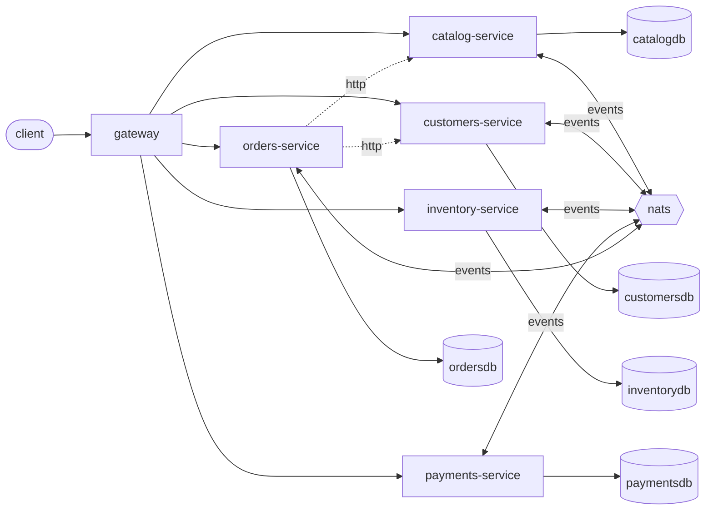

# Architecture

A Go 1.26 `go.work` workspace: one module per service, a shared kernel (`pkg/`)
kept to transport concerns, and a go-proxy gateway at the edge. Router: gin. Data: gorm on
PostgreSQL, one database per service. Events: nats through a transactional outbox.

| Module | Owns tables | Calls | Routes |
|---|---|---|---|
| `services/catalog` | Category, Product | — | /api/products |
| `services/customers` | Customer | — | /api/customers |
| `services/inventory` | StockItem | — | /api/inventory |
| `services/payments` | Payment | — | /api/payments |
| `services/orders` | Order, OrderLine | catalog, customers | /api/orders |

## Sagas

- **CreateOrder** — orchestrated by `orders`: inventory → payments

## Why these boundaries

The monolith already had one package per business capability (`internal/catalog`, `internal/customers`, `internal/inventory`, `internal/orders`, `internal/payments`), so each package became one service and no candidates were merged. Two entities were kept together because they change together: `Category` and `Product` stay in catalog (`products` has a foreign key to `categories`), and `Order` and `OrderLine` stay in orders, so neither pair needs a distributed join. `StockItem` was split out of the catalog data because stock is written on every reservation, while the price list is mostly read.

Two couplings were accepted as synchronous reads. Orders calls catalog for prices and customers for the active check through typed HTTP clients, and each caller keeps its own copy of the provider's DTOs. Both are cheap, read-only lookups on the order path, and an event-fed read model would only add staleness.

The write coupling was redesigned. `orders` placed an order in one `db.Transaction` that also reserved stock and charged payment. That transaction can no longer span databases, so it became the CreateOrder saga, orchestrated by `orders` through the outbox. Inventory is reserved first and payment is charged last, because it is the hardest step to reverse. If a step fails, the earlier steps are compensated in reverse. The order and its lines are written only in the final local commit, so a failed saga leaves no order row behind. Cross-service events go through each service's transactional outbox, and consumers dedupe on message id.
