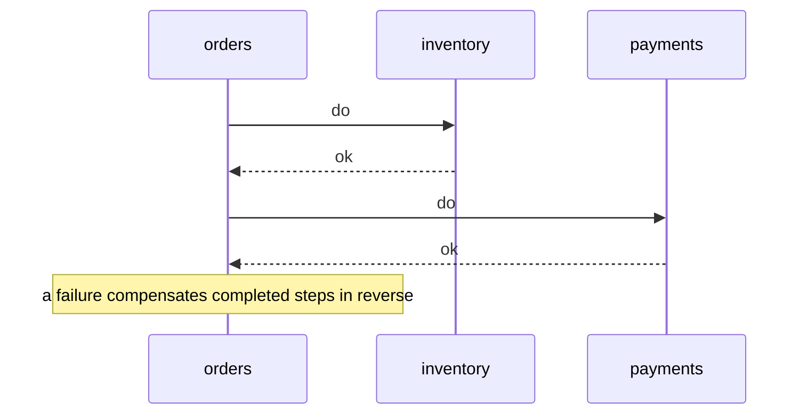
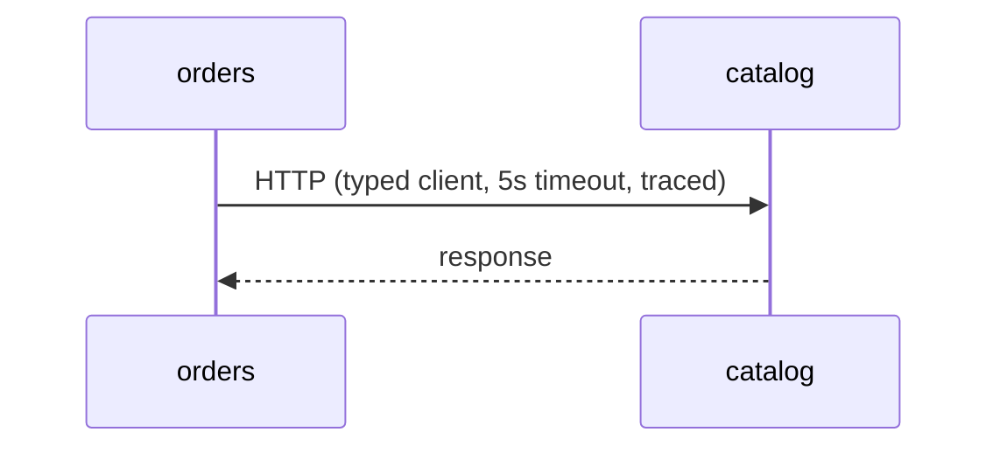
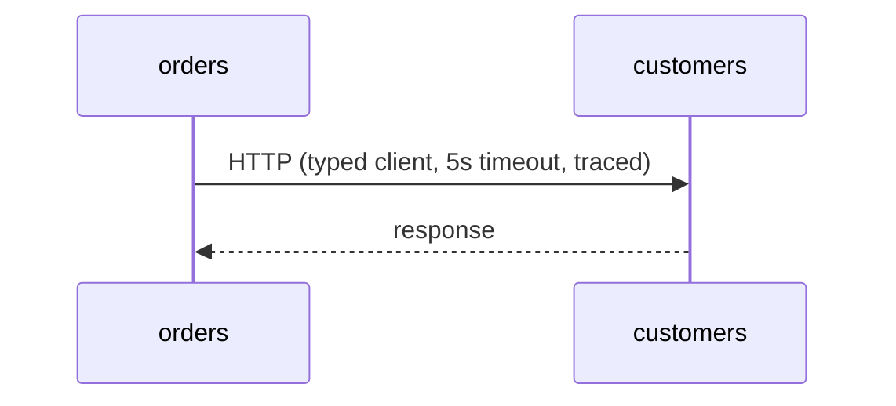

# Sequence diagrams

## CreateOrder

```mermaid
sequenceDiagram
  participant orders
  participant inventory
  participant payments
  orders->>inventory: do
  inventory-->>orders: ok
  orders->>payments: do
  payments-->>orders: ok
  Note over orders: a failure compensates completed steps in reverse
```

## orders → catalog

```mermaid
sequenceDiagram
  orders->>catalog: HTTP (typed client, 5s timeout, traced)
  catalog-->>orders: response
```

## orders → customers

```mermaid
sequenceDiagram
  orders->>customers: HTTP (typed client, 5s timeout, traced)
  customers-->>orders: response
```

